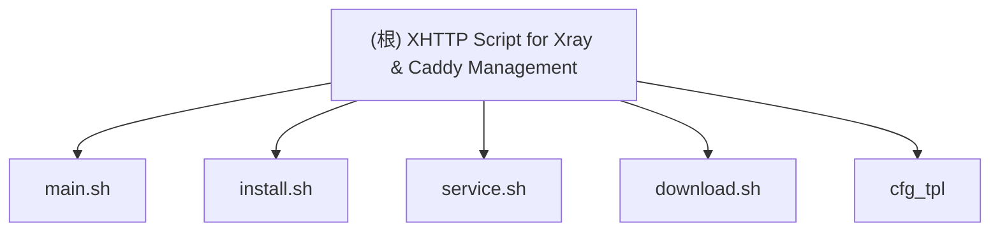

# XHTTP Script for Xray & Caddy Management

## 变更记录 (Changelog)
- 2025-11-01: 初始化架构文档，识别项目结构和模块

## 项目愿景

这是一个 Bash 脚本项目，旨在简化 Xray-core 和 Caddy 服务的部署和管理。该项目提供了一个菜单驱动的界面，用于在 Debian/Ubuntu 系统上安装、配置和管理 Xray 和 Caddy 服务，支持多种协议包括 VLESS/REALITY/XHTTP 和 KCP。

## 架构总览

该项目采用简单的 Bash 脚本架构，包含交互式菜单系统、配置模板和安装管理脚本，为用户提供一键部署 Xray 和 Caddy 服务的解决方案。

## 模块结构图（Mermaid）



## 模块索引

| 模块路径 | 类型 | 职责 | 入口文件 | 测试状态 |
|----------|------|------|----------|----------|
| main.sh | 脚本 | 主菜单与服务管理 | main.sh | 待补充 |
| install.sh | 脚本 | 安装与配置 | install.sh | 待补充 |
| service.sh | 脚本 | 服务管理 | service.sh | 待补充 |
| download.sh | 脚本 | 下载工具 | download.sh | 待补充 |
| cfg_tpl | 配置 | Xray/Caddy 配置模板 | xray_config.json/caddy_config.json | 待补充 |

## 运行与开发

### 环境要求
- x86_64 架构的 Linux 系统
- Debian 或 Ubuntu 操作系统
- Root 用户权限

### 运行方式
```bash
sudo bash main.sh
```

### 安装与配置
1. 运行 `main.sh` 脚本
2. 选择菜单选项（安装服务、修改配置、生成客户端连接配置等）
3. 按照提示输入相关配置信息（域名、KCP 密码、Web 目录等）

## 测试策略

目前项目未发现专门的测试目录或测试脚本。需要通过实际部署验证配置的正确性。

## 编码规范

- 使用 Bash 脚本编程
- 配置文件采用 JSON 格式，使用变量占位符（如 `${DOMAIN}`）
- 代码遵循标准 Bash 编码规范
- 包含必要的注释说明

## AI 使用指引

1. 主要交互脚本为 `main.sh`，包含菜单系统和配置修改逻辑
2. 配置模板位于 `cfg_tpl/` 目录，包含 Xray 和 Caddy 的配置文件
3. 配置文件中的变量占位符需根据实际情况替换
4. 脚本执行需要 root 权限，确保安全检查已通过
5. 所有服务配置均使用模板，支持变量替换机制

## 详细模块说明

### main.sh 模块
- **职责**: 提供交互式菜单系统，管理 Xray 和 Caddy 服务
- **主要功能**: 安装、卸载、修改配置、生成客户端连接
- **依赖检查**: 验证系统架构、操作系统类型和用户权限

### install.sh 模块
- **职责**: 安装和配置 Xray-core 和 Caddy 服务
- **主要功能**: 下载服务程序、生成配置文件、创建 UUID 和密钥对
- **关键处理**: 变量替换、配置文件生成、目录准备

### service.sh 模块
- **职责**: 管理 Xray 和 Caddy 服务的运行状态
- **主要功能**: 启动、停止、重启、状态检查
- **关键处理**: PID 管理、日志记录、进程监控

### download.sh 模块
- **职责**: 下载 Xray-core 和 Caddy 二进制文件
- **主要功能**: 从 GitHub 下载最新版本、解压安装
- **关键处理**: 使用 dra 工具、文件验证

### cfg_tpl 模块
- **职责**: 提供 Xray 和 Caddy 服务的标准配置模板
- **关键配置**:
  - Xray: VLESS/REALITY/XHTTP 协议配置，包含端口 443 的 VLESS 服务和端口 2052 的 KCP 服务
  - Caddy: HTTPS 终止、证书自动化和流量路由配置
  - Client: 客户端连接配置模板